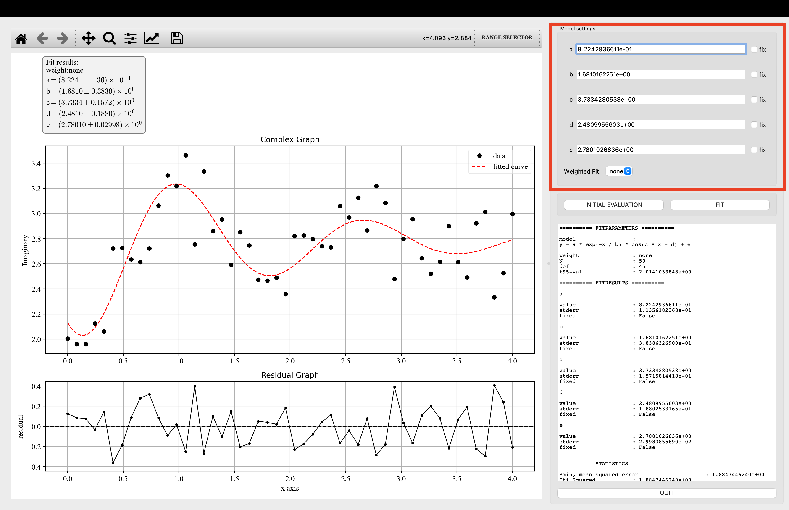
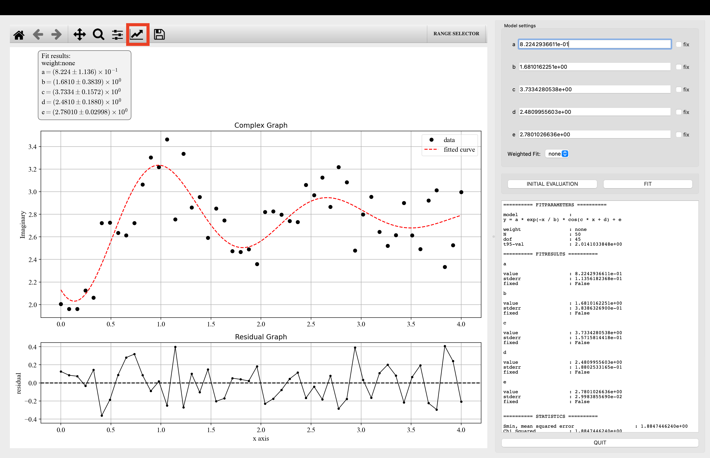
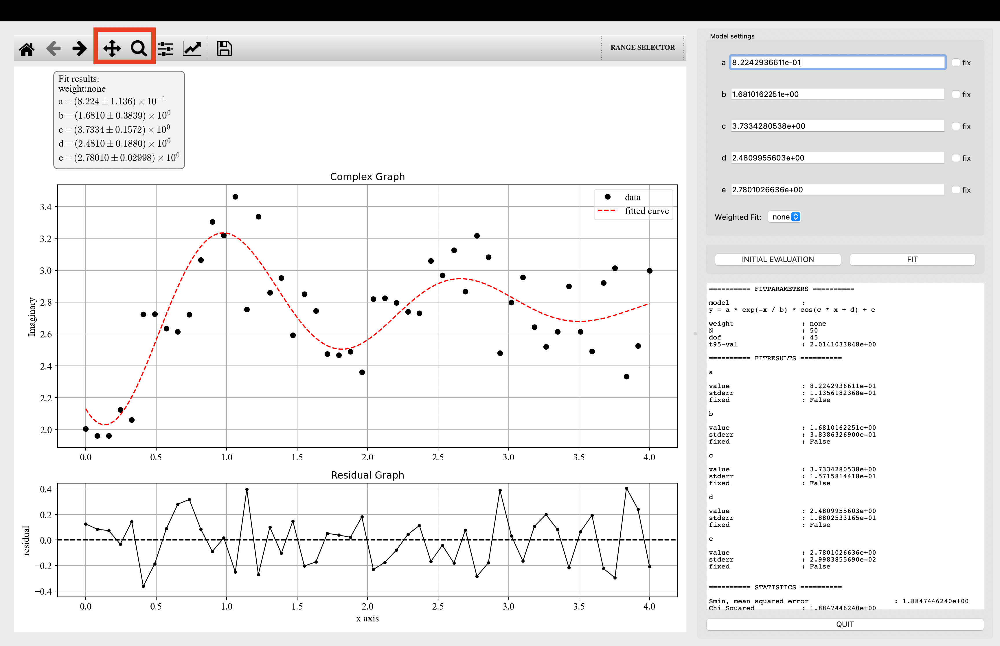
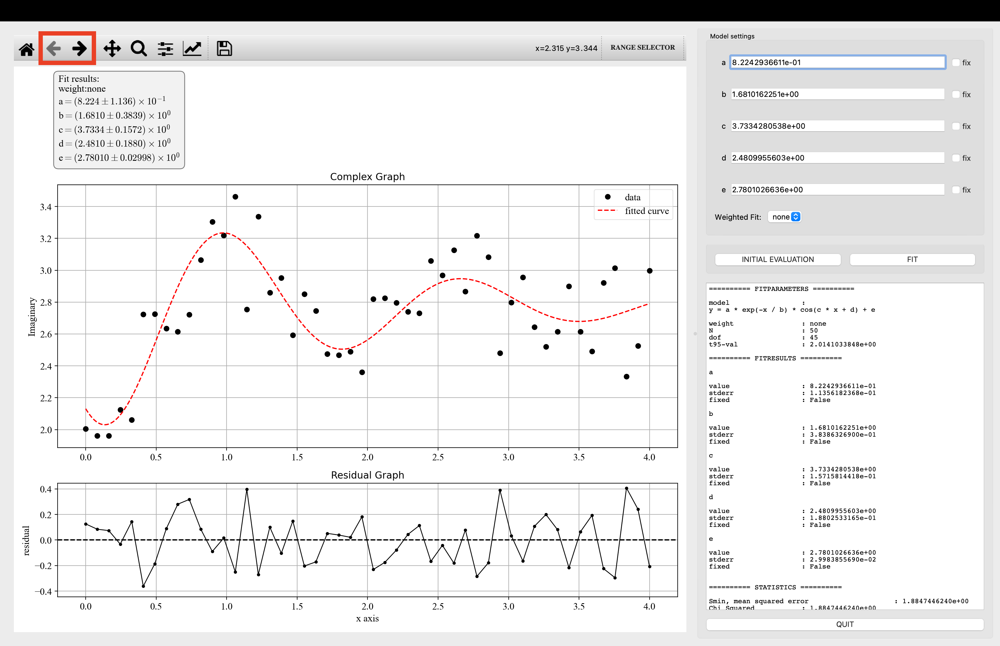
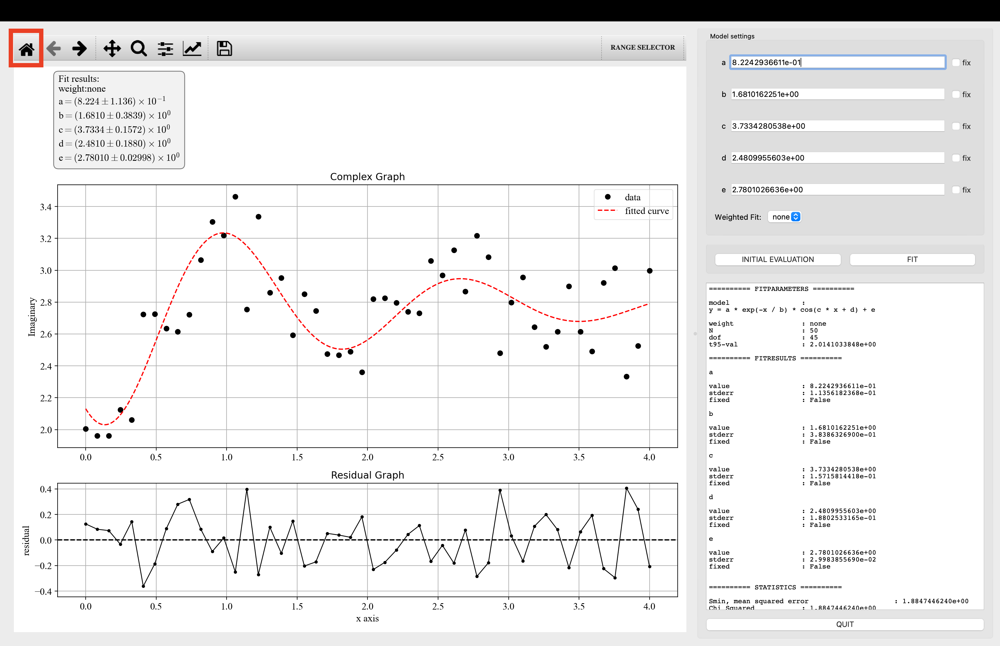
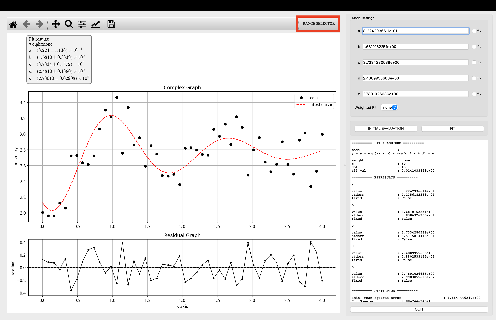
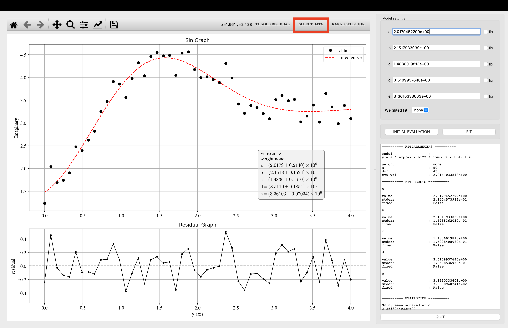
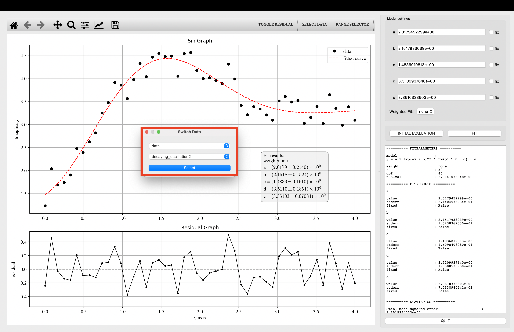
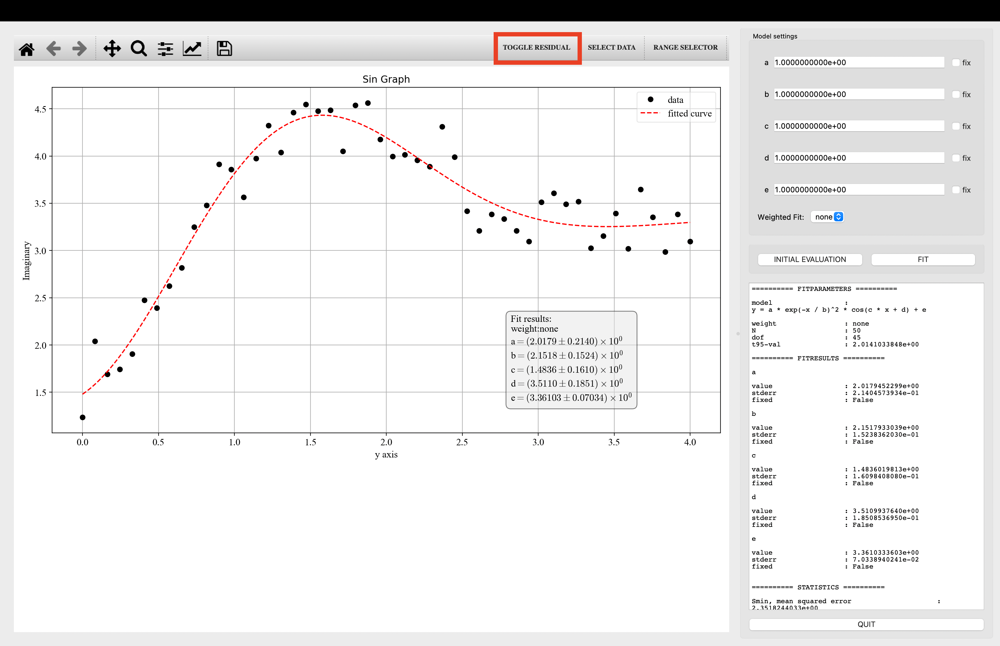

<!--source /Users/kojo/opt/anaconda3/bin/activate
conda activate /Users/kojo/opt/anaconda3-->

## Installation

You can install the `complex-curve-fit-gui` from [PyPi](https://pypi.org/project/complex-curve-fit-gui/):

    pip install complex-curve-fit-gui

The GUI is supported on Python 3.7 and above.  
**Note**: only `complex-curve-fit-gui` is installed without any required dependencies. Depending on if you are using pip or conda to manage your environment you should manually install the following additional packages:  

- Using `pip`:

      pip install numpy scipy matplotlib PyQt5 lmfit sympy

- Using `conda` (required for M1 Mac):    

      conda install numpy scipy matplotlib qtpy pyqt && conda install -c conda-forge lmfit

### Getting Started
1. If on MacOS M1 a conda environment will be needed
2. import the gui:
       `from complex_curve_fit_gui import curve_fit_gui`
3. define x and y data as 1 dimensional numpy arrays of equal length
       `xdata = np.array([1, 2, 3, 4, 5])`
       `ydata = np.array([-3.5, -2.4, -1, 0.5, 1.8])`
4. Call curve_fit_gui:
    - Set first parameter to None to be able to select predefined functions
    - For example: 

       `curve_fit_gui(None,xdata,ydata)`
5. Optionally disable gui and immediately get fit results as tuple (popt, pcov, result) where popt is an array of the best-fit parameters, pcov is an array of the confidence intervals, and result is an lmfit ModelResult object. [Model Result](https://lmfit.github.io/lmfit-py/model.html#lmfit.model.ModelResult)
       `curve_fit_gui(function,xdata,ydata, showgui=False)`

### Open Multiple Windows
 - Appending `&` to the end of the command used to run program will give access to current terminal, allowing for another window to be openned. Ex: `python3 curve.py&`

### Plot multiple dataset on single window
 - Use the keyword argument `add` and format argument as an array of tuples i.e `[(np.array, np.array, string)]` where the first index is xdata, the next in y-data, and the last is a label for the data


### curve_fit_gui function:
This starts up the GUI. The call signature is `curve_fit_gui(f,xdata,ydata,xerr=None -> [optional],yerr=None -> [optional],p0=None  -> [optional],xlabel="x-axis" -> [optional],ylabel="y-axis" -> [optional],absolute_sigma=False -> [optional],jac=None -> [optional],showgui=True -> [optional],**kwargs, -> [optional])`
 - f : callable
        the fit function which if set to None, gives option of selection predefined fit functions
 -  xdata : 1-D numpy array
        x-coordinates of the data
 -  ydata : 1-D numpy array
        y-coordinates of the data
 -  yerr : 1-D numpy array, optional (default:None)
        error/uncertainty in y-values used for weighted fit
        with a relative weight defined as 1/yerr**2
        (for compatibility also the use of the keyword sigma can be used for the same)
 - xerr : 1-D numpy array, optional (default:None)
        error in x-values. For plotting errorbars only and ignored during fitting
 - xlabel : string, optional (default:'x-values')
        x-axis title in the plot
 - ylabel : string, optional (default:'y-values')
        y-axis title in the plot
 - title  : string, optional
        data plot title
 - p0 : array-like, optional
        initial values for fit parameters, if not specified 1 is used for each parameter, if specified length must be >= number of fit parameters else program crashes upon fit
 - method : string, optional
       desired fit method for lmfit model, default is "least squares"
 - showgui : boolean, optional (default=True)
        if True, the gui is shown, otherwise not
 - absolute_sigma : boolean, optional
        see doc-string scipy.optimize.curve_fit()
 - add : array of tuple, optional
       add additional data sets, requires format `[(np.array, np.array, string)]` which implies `[(x_data, y_data, label)]`. Multiple datasets can be placed in the array, and method is selectable within gui
 - kwargs
        keyword arguments for compatibility (e.g. you can use sigma to specify the error in y)

### Return Data
- The curve fit function returns a tuple with three elements.
       1. Array containing the fit parameters
       2. Array containing the standard error (+/-)
       3. lmfit Model_Result object pertaining to the best fit, reference here: https://lmfit.github.io/lmfit-py/model.html#the-modelresult-class

### User defined functions
 - To make a user defined function create a function and pass to curve_fit_gui as f. For example: 
 ```python
       def linear(x, a, b, c): 
              '''
              y = a * x + b
              '''
              return y = a * x + b

       curve_fit_gui(linear, xdata, ydata)
```

### User defined complex functions
 - When defining a complex function add the **complex=True** keyword argument and use `1j` in the equation. For example for Euler's equation e^(ix)cs:
       `return a * (np.exp(1j * (x)))`


### Customizing Data Plot
The plots are customizable from inside the gui and also from the `curve_fit_gui` function call by using keyword arguments or kwargs. The options available from a matplotlib plot are also available for the main data plot
For example: `curve_fit_gui(None, xdata, ydata, markerfacecolor="None", linestyle="-"`
**For a list of optional keyword arguments visit the matplotlib documentation on this page under the list of available Line2D properties**: [matplotlib.pyplot.plot](https://matplotlib.org/stable/api/_as_gen/matplotlib.pyplot.plot.html)
 - Note: Use full names i.e. linewidth not lw
 - In addition, title can be set using title keyword argument i.e `curve_fit_gui(...,...,...,title="More Data")`

### Customizing Fitline:
Options for customizing fitline inlclude color, linestyle, and thickness. The values are the same from matplotlib, however the argument is preceded with fitline_. For example `curve_fit_gui(None, xdata, ydata, fitline_color="red", fitline_linestle="-")`. The possible customizations for fitline are:
    - fitline_color
    - fitline_linestyle: supported values are '-', '--', '-.', ':', 'None', ' ', '', 'solid', 'dashed', 'dashdot', 'dotted'
    - fitline_label
    - fitline_linewidth


### GUI controls
1. **Data plot:** A matplotlib plot that shows the data as solid dots and both y-error and x-error errorbars if provided. A fitted curve as a dashed line is shown if a fit is performed.
2. **Residual plot** A matplotlib plot that shows the residuals as the difference between the measured and fitted values:
3. **Model settings:** Here you can enter inital values for the fitparameters. By ticking the checkbox `fix` you can set a parameter to fixed:e.g. the parameter is not optimised during the fit.
 
4. **Weight settings:** If error data on the y-values are passed using the keyword argument `yerr` you can use the dropdownbox to set how the error data is treated:
    - *None*: the error data is ignored
    - *Relative*: Use the error data for a relative weight. Corresponds to setting scipy's curve_fit() function keyword `absolute_sigma = False`.
    - *Standard deviation*: Treat the error data as being standard deviations. Corresponds to setting scipy's curve_fit() function keyword `absolute_sigma = True`.
5. **Evaluate:** Use this button to compute the model function given the current values of the parameters (set in the model settings panel)
6. **Fit:** Performs the fit and updates the parameter values.
7. **Report:** When a fit is performed, the results are shown here. The information on the model is actually the provided docstring of the function `f` that is passed to the `curvefitgui` function.
8. **Quit:** Quits the gui and returns a tuple of best-fit parameters, confidence interval, and Model Result object from lmfit. [Model Result](https://lmfit.github.io/lmfit-py/model.html#lmfit.model.ModelResult)
9. **Toolbar:** This is the standard matplotlib toolbar to adjust some plot properties and provides zoom/pan and save options.
  - **Customize** Change visual features of the plot such as marker type or color and axis titles 
  - **Pan and Zoom** Shift and zoom on plot 
  - **Left and Right** Undo and redo actions for shift and zoom 
  - **Home** Return to original plot view 
10. **FitTextbox:** This textbox is generated if a valid fit is performed. It can be moved by the mouse to any convenient positions in the plot.
11. **Range Selector** Activates/deactivates the range-selector. The range-selector allows to select a datarange used for fitting. Only datapoints that are within the two vertical dashed lines are considered during fitting. The lines can be moved using the mouse.

12. **SELECT DATA** Allows user to switch between plotted dataset and desired fit model


13. **TOGGLE Residual** show/hide residual plot



<!-- To run program
`python3 curve.py"`

#### For someone looking to expand this code:
The _tools.py file is the main backend of this program. Here you will find the functionality of the the things seen on the front end.
At current state the program uses custom classes such as FitModel, FitData, FitParameter. These are parts left over from prior to integration with with lmfit model. They were left as they integrate better with the front end. However all the data from those classes can be accessed through the lmfit model. -->
